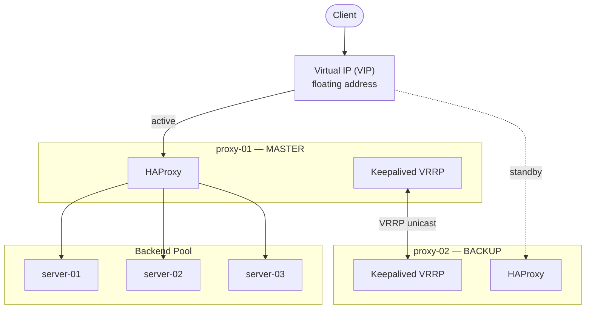

# Ansible Role - HAProxy + Keepalived


[](https://www.linkedin.com/company/devopsgroup8/)


Ansible role that installs and configures **HAProxy** and **Keepalived** for high availability load balancing. Works with any backend — web apps, APIs, databases, Kubernetes, and more.

- **HAProxy** — high-performance TCP/HTTP load balancer with health checks, SSL termination, and a built-in stats page.
- **Keepalived** — VRRP-based floating VIP that automatically shifts to a backup node when the master fails.

**Official docs:** [HAProxy](https://www.haproxy.com/documentation/haproxy-configuration-manual/latest/) · [Keepalived](https://keepalived.readthedocs.io/en/latest/)

---

## Table of Contents

- [Requirements](#requirements)
- [Quick Start](#quick-start)
- [Architecture](#architecture)
- [Inventory Structure](#inventory-structure)
- [Variables](#variables)
  - [Core](#core)
  - [Frontends](#frontends)
  - [Backends](#backends)
  - [Keepalived](#keepalived)
  - [Cloud Floating IP](#cloud-floating-ip)
- [Backend Server Specification](#backend-server-specification)
- [Directory Structure](#directory-structure)
- [Troubleshooting](#troubleshooting)
- [Contributing](#contributing)
- [License](#license)

---

## Requirements

- Ansible >= 2.18
- `become: true` (root access required)
- Two proxy nodes for HA (one master, one backup)
- Supported OS: Ubuntu 22.04 / 24.04, Debian 12, Rocky Linux 9, Oracle Linux 9, RHEL 9

---

## Quick Start

### 1. Inventory

```ini
[proxy_hosts]
proxy-01 ansible_host=10.0.0.2 ansible_user=root
proxy-02 ansible_host=10.0.0.3 ansible_user=root

[app_servers]
app-01 ansible_host=10.0.1.10
app-02 ansible_host=10.0.1.11
app-03 ansible_host=10.0.1.12
```

### 2. Playbook

```yaml
- name: Deploy HAProxy + Keepalived
  hosts: proxy_hosts
  become: true
  vars:
    loadbalancer_master: "proxy-01"
    loadbalancer_backup: "proxy-02"

    keepalived_enabled: true
    keepalived_network_interface: "eth0"
    keepalived_vrrp_instances:
      - vrrp_instance_name: VI_1
        virtual_ipaddress: "10.0.0.100"
        virtual_router_id: 51

    haproxy_frontends:
      - name: http_frontend
        address: "*"
        port: 80
        default_backend: app_backend
        mode: http

    haproxy_backends:
      - name: app_backend
        balance: roundrobin
        mode: http
        httpcheck: true
        servers: "{{ groups['app_servers'] }}"
        port: 8080
        options:
          - check
  roles:
    - role: ansible-role-haproxy-keepalived
```

### 3. Run

```bash
ansible-playbook -i inventory.ini playbook.yml
```

### 4. Access

| Service | URL |
|---------|-----|
| Application | `http://10.0.0.100` |
| HAProxy Stats | `http://10.0.0.100:1936/haproxy/stats` |

---

## Architecture



> Full diagrams — failover sequence, cloud floating IP flow, request path, task execution order: [docs/ARCHITECTURE.md](docs/ARCHITECTURE.md)

---

## Inventory Structure

The role identifies the master and backup nodes by hostname using `loadbalancer_master` and `loadbalancer_backup`. Both nodes run HAProxy; Keepalived assigns the VIP to the master and fails over to the backup if the master goes down.

---

## Variables

### Core

| Variable | Default | Description |
|----------|---------|-------------|
| `haproxy_enabled` | `true` | Install and configure HAProxy |
| `haproxy_version` | `3.1.4` | HAProxy version to install |
| `loadbalancer_master` | — | Hostname of the master proxy node |
| `loadbalancer_backup` | — | Hostname of the backup proxy node |
| `haproxy_mode` | `http` | Default proxy mode: `http` or `tcp` |
| `haproxy_maxconn` | `3000` | Maximum simultaneous connections |
| `haproxy_retries` | `3` | Connection retry attempts |
| `haproxy_timeout_connect` | `10s` | Backend connection timeout |
| `haproxy_timeout_client` | `1m` | Client inactivity timeout |
| `haproxy_timeout_server` | `1m` | Server response timeout |
| `haproxy_timeout_check` | `10s` | Health check timeout |
| `haproxy_stats` | `true` | Enable the HAProxy statistics page |
| `haproxy_stats_port` | `1936` | Statistics page port |
| `haproxy_stats_bind_addr` | `0.0.0.0` | Statistics page bind address |
| `haproxy_stats_page_user` | `admin` | Statistics page username |
| `haproxy_stats_page_pass` | — | Statistics page password (use Vault) |
| `haproxy_stats_page_uri` | `/haproxy/stats` | Statistics page URI |

### Frontends

```yaml
haproxy_frontends:
  - name: http_frontend        # Unique frontend name
    address: "*"               # Bind address
    port: 80                   # Bind port
    default_backend: app_backend
    mode: http                 # http or tcp
    ssl: false                 # Enable SSL termination (optional)
    crts: []                   # List of PEM certificate paths (optional)
    monitor_uri: /health       # Expose a health check URI (optional)
```

### Backends

```yaml
haproxy_backend_default_balance: roundrobin

haproxy_backends:
  - name: app_backend
    balance: roundrobin        # Load balancing algorithm
    mode: http                 # http or tcp
    httpcheck: true            # Enable HTTP health checks
    servers: "{{ groups['app_servers'] }}"  # See backend specification methods below
    port: 8080
    options:
      - check
```

### Keepalived

```yaml
keepalived_enabled: true
keepalived_version: 2.3.2
keepalived_network_interface: eth0   # Interface to bind the VIP to

keepalived_vrrp_instances:
  - vrrp_instance_name: VI_1         # Must be unique per instance
    virtual_ipaddress: "10.0.0.100"  # The floating VIP
    virtual_router_id: 51            # 1-255, must be unique per VRRP cluster
```

Multiple VIPs are supported — add more items to `keepalived_vrrp_instances`.

### Cloud Floating IP

For **Hetzner Cloud** environments with a provider-managed floating IP. Only
Hetzner is supported — the notify script speaks the Hetzner Cloud v1 API.
DigitalOcean and AWS are not implemented (different API shape / SigV4 auth).

```yaml
cloud_floating_ip_enabled: true
cloud_api_token: "{{ vault_cloud_api_token }}"
cloud_floating_ip_address: "1.2.3.4"
```

The API token is written to `/etc/keepalived/cloud-floating-ip.env` (`0600`),
never into the script body. On VIP transition, Keepalived runs the notify
script which reassigns the Hetzner floating IP to the new master.

---

## Backend Server Specification

Three methods are supported — choose based on your setup:

### 1. Inventory group (recommended)

```yaml
servers: "{{ groups['app_servers'] }}"
```

Hostnames are automatically resolved to IPs from your inventory.

### 2. Hostname list

```yaml
servers:
  - app-01
  - app-02
  - app-03
```

### 3. Explicit IPs

```yaml
servers:
  - name: app-01
    address: 10.0.1.10
    port: 8080
  - name: app-02
    address: 10.0.1.11
    port: 8080
```

---

## Directory Structure

```
ansible-role-haproxy-keepalived/
├── defaults/
│   └── main.yml                        # All default variables
├── files/
│   └── certs/                          # SSL certificate storage
├── handlers/
│   └── main.yml                        # Reload HAProxy / Keepalived
├── tasks/
│   ├── main.yml                        # Entry point
│   ├── setup.yml                       # Package installation
│   ├── validate.yml                    # Input validation
│   ├── haproxy.yml                     # HAProxy config + service
│   ├── keepalived.yml                  # Keepalived config + service
│   └── cloud_floating_ip.yml           # Cloud floating IP notify script
├── templates/
│   ├── haproxy.cfg.j2                  # HAProxy configuration
│   ├── keepalived.conf.j2              # Keepalived configuration
│   └── cloud-floating-ip-notify.sh.j2 # Failover notify script
└── meta/
    └── main.yml                        # Galaxy metadata
```

---

## Troubleshooting

See [docs/TROUBLESHOOTING.md](docs/TROUBLESHOOTING.md) for common issues.

**Quick checks:**

```bash
# HAProxy status and config test
systemctl status haproxy
haproxy -c -f /etc/haproxy/haproxy.cfg

# Keepalived status and VIP assignment
systemctl status keepalived
ip addr show | grep <vip-address>

# Live HAProxy logs
journalctl -u haproxy -f

# Stats page (requires credentials)
curl -u admin:<password> http://<vip>:1936/haproxy/stats
```

---

## Contributing

We welcome contributions! Please see [CONTRIBUTING.md](CONTRIBUTING.md) to get started.

## Code of Conduct

Read our [Code of Conduct](CODE_OF_CONDUCT.md).

## Changelog

See [CHANGELOG.md](CHANGELOG.md) for release history.

## License

```
Copyright 2025 DevOpsGroup

Licensed under the Apache License, Version 2.0 (the "License");
you may not use this file except in compliance with the License.
You may obtain a copy of the License at

    http://www.apache.org/licenses/LICENSE-2.0

Unless required by applicable law or agreed to in writing, software
distributed under the License is distributed on an "AS IS" BASIS,
WITHOUT WARRANTIES OR CONDITIONS OF ANY KIND, either express or implied.
See the License for the specific language governing permissions and
limitations under the License.
```

---

> For more information or support, please refer to the official documentation or contact us at info@devopsgroup.sk
