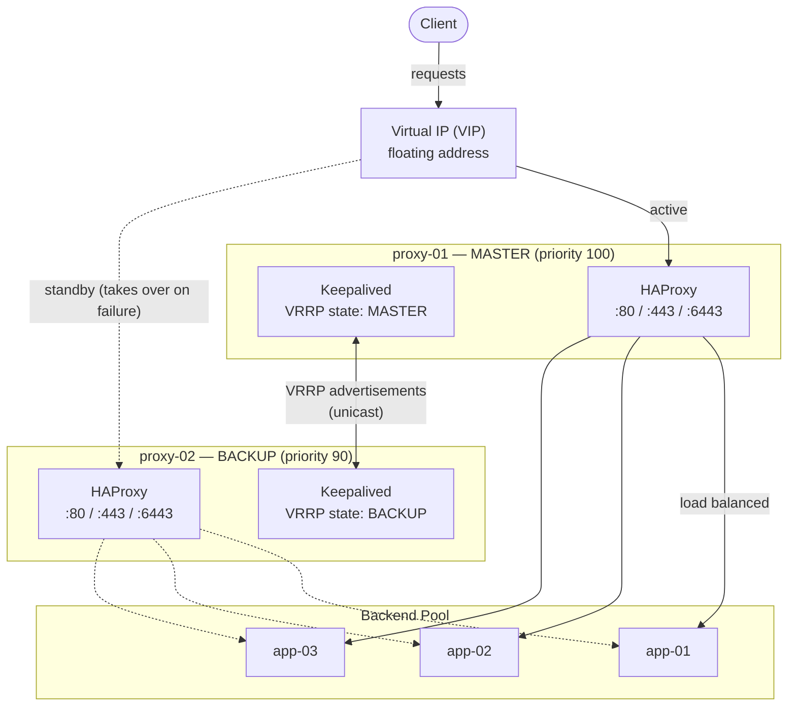
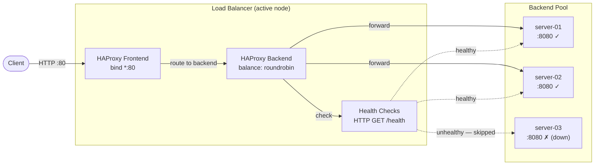
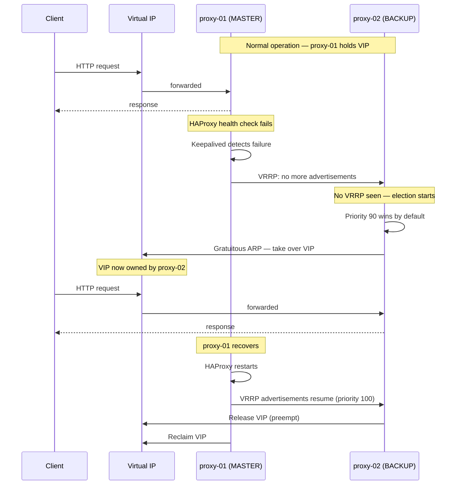
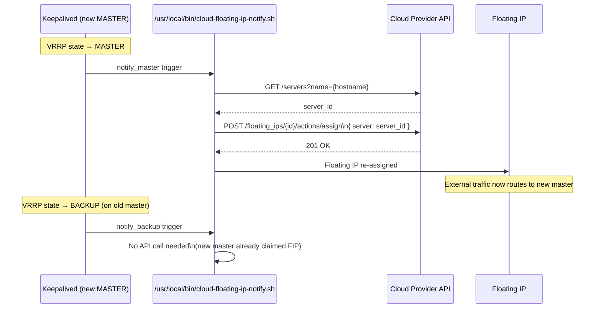
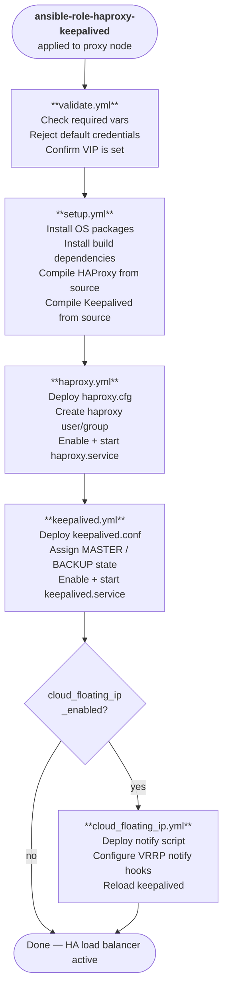

# Architecture

Visual reference for the HAProxy + Keepalived role — how components are laid out, how traffic flows, how failover works, and how the Ansible role executes.

---

## Table of Contents

- [HA Topology](#ha-topology)
- [Request Flow](#request-flow)
- [VRRP Failover Sequence](#vrrp-failover-sequence)
- [Cloud Floating IP Failover](#cloud-floating-ip-failover)
- [Role Task Execution Order](#role-task-execution-order)

---

## HA Topology

Active-passive setup: both nodes run HAProxy; Keepalived assigns the VIP to the master. If the master fails, the VIP moves to the backup within 2–3 seconds.

---

## Request Flow

Path of a single HTTP request from client to backend.

---

## VRRP Failover Sequence

What happens when the master node's HAProxy stops responding.

---

## Cloud Floating IP Failover

When `cloud_floating_ip_enabled: true`, a notify script calls the cloud provider API on every VRRP state transition to move the public Floating IP to the new master.

---

## Role Task Execution Order

Tasks that run when the role is applied to a proxy node.

